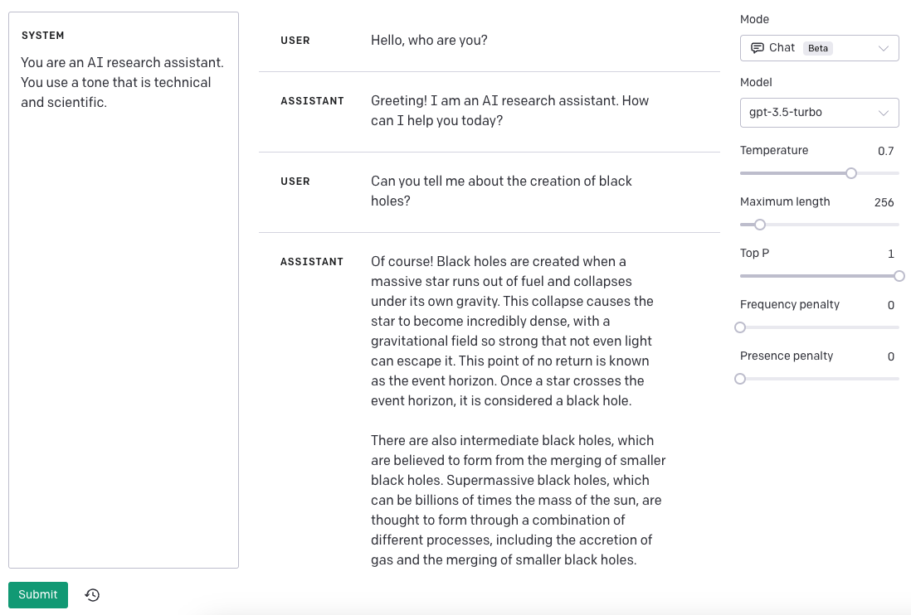
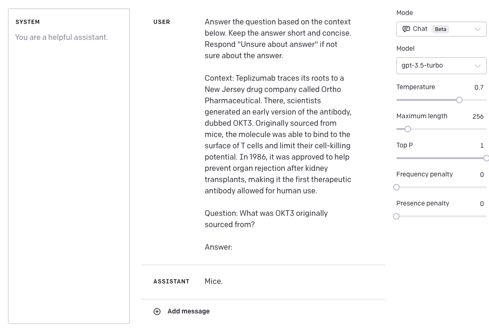

# ChatGPT Prompt Engineering

在这个部分，我们将介绍 ChatGPT 的最新提示工程技术，包括技巧、应用、限制、论文和额外的阅读材料。


主题：


与 ChatGPT 对话
Python 笔记本
**请注意，本部分正在紧密开发中。**

Topics:
- [ChatGPT介绍](#ChatGPT介绍)
- [审查对话任务](#审查对话任务)
- [与ChatGPT对话](#与ChatGPT对话)
- [Python笔记本](#Python笔记本)

---
## ChatGPT介绍


ChatGPT是[OpenAI训练](https://openai.com/blog/chatgpt)的一种新型模型，可以进行对话交互。该模型经过训练，可以按照提示中的指令，在对话上下文中提供适当的回应。ChatGPT 可以帮助回答问题、建议菜谱、按某种风格写歌词、生成代码等等。

ChatGPT 使用人类反馈强化学习（RLHF）进行训练。虽然这个模型比之前的 GPT 版本更具有能力（还经过训练以减少有害和不真实的输出），但它仍然存在限制。让我们通过具体的例子来了解一些能力和限制。

您可以在[这里](https://chat.openai.com) 使用ChatGPT的研究预览，但在下面的例子中，我们将使用 OpenAI Playground 上的“Chat”模式。

---
## 审查对话任务

In one of the [previous guides](https://github.com/dair-ai/Prompt-Engineering-Guide/blob/main/guides/prompts-basic-usage.md#conversation), we covered a bit about conversation capabilities and role prompting. We covered how to instruct the LLM to have a conversation in a specific style, with a specific intent, behavior, and identity.
在[之前的指南](https://github.com/wangxuqi/Prompt-Engineering-Guide-Chinese/blob/main/guides/prompts-basic-usage.md#%E9%97%AE%E7%AD%94)中，我们介绍了一些关于对话能力和角色提示的内容。我们讲解了如何指导LLM以特定的风格、意图、行为和身份进行对话。

让我们回顾一下之前的基本示例，我们创建了一个对话系统，能够生成更技术和科学的回答。

*Prompt:*
```
以下是与AI研究助手进行的对话。助手的语气是技术和科学的。

人类：你好，你是谁？
AI：您好！我是一个AI研究助手。我今天可以帮您什么？
人类：你能告诉我关于黑洞的形成吗？
AI：
```

从上面的例子中，您可以看到两个重要组成部分：

**意图**或者解释聊天机器人是什么
**身份**，它指导聊天机器人用什么风格或语气来回复

上述简单示例适用于使用text-davinci-003的文本完成API。最近，OpenAI宣布了[ChatGPT APIs](https://openai.com/blog/introducing-chatgpt-and-whisper-apis)，它是一种更强大和更便宜的模型，名为gpt-3.5-turbo，专门用于这种类型的功能（聊天完成）。OpenAI推荐它作为它们的最佳模型，即使是非聊天的用例也是如此。使用ChatGPT API的其他好处是显着的成本降低（90%）和效率。
Snap Inc.和Instacart等大公司已经在他们的产品上集成了由ChatGPT支持的对话功能，从个性化推荐到开放式购物目标不等。

---
## 使用ChatGPT进行对话

### 多轮对话

为了展示ChatGPT的能力，我们将使用上面的聊天机器人助手示例并讨论结果。与text-davinci-003相比，为ChatGPT提供动力的gpt-3.5-turbo模型使用聊天格式作为输入。模型期望一系列消息作为输入，然后使用这些消息生成响应。

*Input:*
```
系统: 你是一个使用技术性和科学性语气的AI研究助手。
用户: 你好，你是谁？
助手: 你好！我是一名AI研究助手。今天我能为你做些什么？
用户: 你能告诉我黑洞是如何产生的吗？
```

*Output:*
```
助手: 当然可以！黑洞是由于一个大质量星体耗尽燃料并在自身引力作用下崩塌形成的。这种崩塌导致星体变得极为致密，具有极强的引力场，甚至连光线都无法逃脱。这个无法回头的点称为事件视界。一旦一颗星体穿过事件视界，它就被认为是一个黑洞...
```

请注意，在上面的示例中，我已经简化了输入和输出，但是ChatGPT聊天补全API要求消息以特定的格式提供。我在下面添加了一个快照，展示了在OpenAI Playground中使用Chat Mode时，此示例的外观：



对于我们的示例，更正式的API调用可能类似于以下示例：

```python
import openai

openai.ChatCompletion.create(
  model="gpt-3.5-turbo",
  messages=[
        {"role": "系统", "content": "你是一个使用技术性和科学性语气的AI研究助手。"},
        {"role": "用户", "content": "你好，你是谁？"},
        {"role": "助手", "content": "你好！我是一名AI研究助手。今天我能为你做些什么？"},
        {"role": "用户", "content": "你能告诉我黑洞是如何产生的吗？"}
    ]
)
```

未来开发人员与ChatGPT交互的方式预计将通过[Chat Markup Language](https://github.com/openai/openai-python/blob/main/chatml.md)（简称ChatML）完成。

### 单轮任务

聊天格式使得多轮对话成为可能，但它也支持类似我们使用text-davinci-003进行的单轮任务。这意味着我们可以使用ChatGPT执行类似于我们对原始GPT模型进行演示的任务。例如，让我们尝试使用ChatGPT执行以下问答任务：

*Input:*
```
USER：根据下文回答问题。保持答案简短明了。如果不确定答案，请回答“不确定答案”。

背景：Teplizumab的根源可以追溯到名为Ortho Pharmaceutical的新泽西州制药公司。在那里，科学家生成了抗体的早期版本，称为OKT3。最初从小鼠中获得，这种分子能够结合到T细胞的表面并限制它们的细胞杀伤潜力。 1986年，它获得批准，用于帮助预防肾脏移植后器官排斥，成为首个允许人类使用的治疗性抗体。

问题：OKT3最初是从哪里获得的？

回答：
```

*Output:*
```
ASSISTANT：小鼠。
```

请注意，我添加了“USER”和“ASSISTANT”标签，以更好地演示如何使用ChatGPT执行任务。以下是使用Playground的示例：



更正式地说，这是API调用（我仅包括请求的消息组件）：

```python
CONTENT = """Answer the question based on the context below. Keep the answer short and concise. Respond \"Unsure about answer\" if not sure about the answer.

Context: Teplizumab traces its roots to a New Jersey drug company called Ortho Pharmaceutical. There, scientists generated an early version of the antibody, dubbed OKT3. Originally sourced from mice, the molecule was able to bind to the surface of T cells and limit their cell-killing potential. In 1986, it was approved to help prevent organ rejection after kidney transplants, making it the first therapeutic antibody allowed for human use.

Question: What was OKT3 originally sourced from?

Answer:
"""

response = openai.ChatCompletion.create(
    model="gpt-3.5-turbo",
    messages=[
        {"role": "user", "content": CONTENT},
    ],
    temperature=0,
)
```

### Instructing Chat Models

根据官方OpenAI文档，gpt-3.5-turbo模型的快照也将提供。例如，我们可以访问3月1日的快照gpt-3.5-turbo-0301。这使得开发人员可以选择特定的模型版本。这也意味着指导模型的最佳实践可能会从一个版本变化到另一个版本。

目前针对gpt-3.5-turbo-0301的推荐做法是，在user消息中添加指令，而不是在可用的system消息中添加指令。

---
## Python笔记本

|描述|Python笔记本|
|--|--|
|学习如何使用openai库调用ChatGPT API|[ChatGPT API介绍](../notebooks/pe-chatgpt-intro.ipynb)|
|学习如何使用LangChain库使用ChatGPT特性。|[ChatGPT API with LangChain](../notebooks/pe-chatgpt-langchain.ipynb)|

---
## 参考资料(英文)

- [Seeing ChatGPT Through Students' Eyes: An Analysis of TikTok Data](https://arxiv.org/abs/2303.05349) (March 2023)
- [Extracting Accurate Materials Data from Research Papers with Conversational Language Models and Prompt Engineering -- Example of ChatGPT](https://arxiv.org/abs/2303.05352) (Mar 2023)
- [ChatGPT is on the horizon: Could a large language model be all we need for Intelligent Transportation?](https://arxiv.org/abs/2303.05382) (Mar 2023)
- [Making a Computational Attorney](https://arxiv.org/abs/2303.05383) (Mar 2023)
- [Does Synthetic Data Generation of LLMs Help Clinical Text Mining?](https://arxiv.org/abs/2303.04360) (Mar 2023)
- [MenuCraft: Interactive Menu System Design with Large Language Models](https://arxiv.org/abs/2303.04496) (Mar 2023)
- [A Comprehensive Survey of AI-Generated Content (AIGC): A History of Generative AI from GAN to ChatGPT](https://arxiv.org/abs/2303.04226) (Mar 2023)
- [Exploring the Feasibility of ChatGPT for Event Extraction](https://arxiv.org/abs/2303.03836)
- [ChatGPT: Beginning of an End of Manual Annotation? Use Case of Automatic Genre Identification](https://arxiv.org/abs/2303.03953) (Mar 2023)
- [Is ChatGPT a Good NLG Evaluator? A Preliminary Study](https://arxiv.org/abs/2303.04048) (Mar 2023)
- [Will Affective Computing Emerge from Foundation Models and General AI? A First Evaluation on ChatGPT](https://arxiv.org/abs/2303.03186) (Mar 2023)
- [UZH_CLyp at SemEval-2023 Task 9: Head-First Fine-Tuning and ChatGPT Data Generation for Cross-Lingual Learning in Tweet Intimacy Prediction](https://arxiv.org/abs/2303.01194) (Mar 2023)
- [How to format inputs to ChatGPT models](https://github.com/openai/openai-cookbook/blob/main/examples/How_to_format_inputs_to_ChatGPT_models.ipynb) (Mar 2023)
- [Can ChatGPT Assess Human Personalities? A General Evaluation Framework](https://arxiv.org/abs/2303.01248) (Mar 2023)
- [Cross-Lingual Summarization via ChatGPT](https://arxiv.org/abs/2302.14229) (Feb 2023)
- [ChatAug: Leveraging ChatGPT for Text Data Augmentation](https://arxiv.org/abs/2302.13007) (Feb 2023)
- [Dr ChatGPT, tell me what I want to hear: How prompt knowledge impacts health answer correctness](https://arxiv.org/abs/2302.13793) (Feb 2023)
- [An Independent Evaluation of ChatGPT on Mathematical Word Problems (MWP)](https://arxiv.org/abs/2302.13814) (Feb 2023)
- [ChatGPT: A Meta-Analysis after 2.5 Months](https://arxiv.org/abs/2302.13795) (Feb 2023)
- [Let's have a chat! A Conversation with ChatGPT: Technology, Applications, and Limitations](https://arxiv.org/abs/2302.13817) (Feb 2023)
- [Check Your Facts and Try Again: Improving Large Language Models with External Knowledge and Automated Feedback](https://arxiv.org/abs/2302.12813) (Feb 2023)
- [On the Robustness of ChatGPT: An Adversarial and Out-of-distribution Perspective](https://arxiv.org/abs/2302.12095) (Feb 2023)
- [How Generative AI models such as ChatGPT can be (Mis)Used in SPC Practice, Education, and Research? An Exploratory Study](https://arxiv.org/abs/2302.10916) (Feb 2023)
- [Can ChatGPT Understand Too? A Comparative Study on ChatGPT and Fine-tuned BERT](https://arxiv.org/abs/2302.10198) (Feb 2023)
- [A Prompt Pattern Catalog to Enhance Prompt Engineering with ChatGPT](https://arxiv.org/abs/2302.11382) (Feb 2023)
- [Zero-Shot Information Extraction via Chatting with ChatGPT](https://arxiv.org/abs/2302.10205) (Feb 2023)
- [ChatGPT: Jack of all trades, master of none](https://arxiv.org/abs/2302.10724) (Feb 2023)
- [A Pilot Evaluation of ChatGPT and DALL-E 2 on Decision Making and Spatial Reasoning](https://arxiv.org/abs/2302.09068) (Feb 2023)
- [Netizens, Academicians, and Information Professionals' Opinions About AI With Special Reference To ChatGPT](https://arxiv.org/abs/2302.07136) (Feb 2023)
- [Linguistic ambiguity analysis in ChatGPT](https://arxiv.org/abs/2302.06426) (Feb 2023)
- [ChatGPT versus Traditional Question Answering for Knowledge Graphs: Current Status and Future Directions Towards Knowledge Graph Chatbots](https://arxiv.org/abs/2302.06466) (Feb 2023)
- [What ChatGPT and generative AI mean for science](https://www.nature.com/articles/d41586-023-00340-6) (Feb 2023)
- [Applying BERT and ChatGPT for Sentiment Analysis of Lyme Disease in Scientific Literature](https://arxiv.org/abs/2302.06474) (Feb 2023)
- [Exploring AI Ethics of ChatGPT: A Diagnostic Analysis](https://arxiv.org/abs/2301.12867) (Jan 2023)
- [ChatGPT for Good? On Opportunities and Challenges of Large Language Models for Education](https://www.edu.sot.tum.de/fileadmin/w00bed/hctl/_my_direct_uploads/ChatGPT_for_Good_.pdf) (Jan 2023)
- [The political ideology of conversational AI: Converging evidence on ChatGPT's pro-environmental, left-libertarian orientation](https://arxiv.org/abs/2301.01768) (Jan 2023)
- [Techniques to improve reliability - OpenAI Cookbook](https://github.com/openai/openai-cookbook/blob/main/techniques_to_improve_reliability.md)
- [Awesome ChatGPT Prompts](https://github.com/f/awesome-chatgpt-prompts)
- [Introducing ChatGPT](https://openai.com/blog/chatgpt) (Nov 2022)

---
[上一节 (应用)](./prompts-applications.md)

[下一节 (对抗性提示)](./prompts-adversarial.md)
