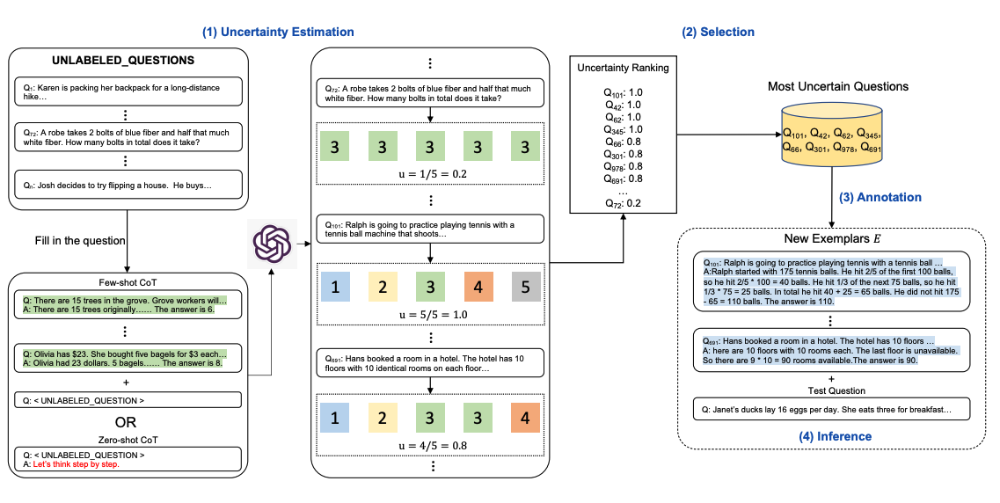
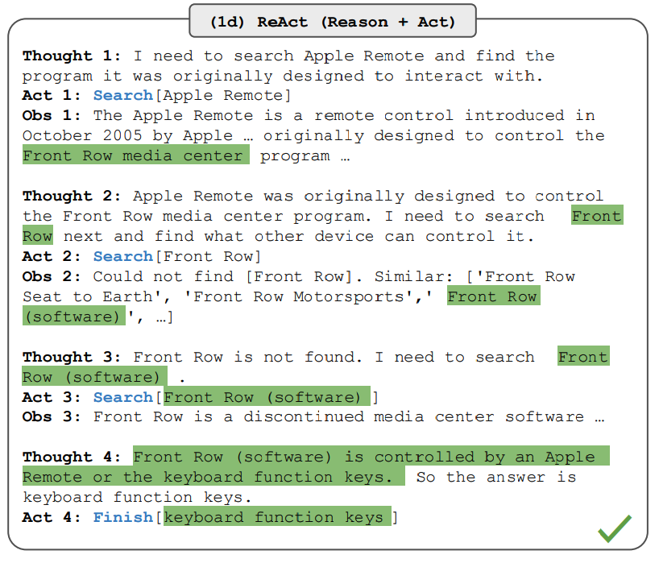
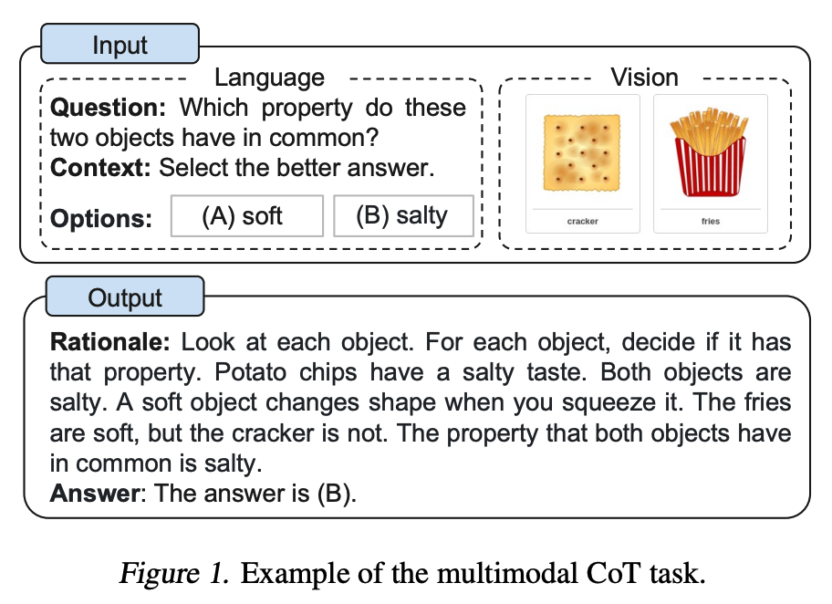

# 杂项主题

在本节中，我们讨论了有关提示工程的其他杂项和未分类主题。它包括相对较新的想法和方法，这些想法和方法最终会随着更广泛的采用而被纳入主要指南。阅读本指南的这一部分还有助于了解有关提示工程的最新研究论文。
**请注意，本节正在进行大量开发。**

Topic:
- [主动Prompt](#active-prompt)
- [定向刺激Prompt](#directional-stimulus-prompting)
- [ReAct](#react)
- [多模态CoTPrompt](#multimodal-prompting)
- [GraphPrompts](#graphprompts)
- ...

---

## 主动Prompt

链式思维（CoT）方法依赖于一组固定的人工注释示例。这样的问题是，这些示例可能不是不同任务中最有效的示例。为了解决这个问题，Diao et al., (2023) 最近提出了一种名为 Active-Prompt 的新提示方法，以适应具有人类设计的 CoT 推理的不同任务特定示例提示。

以下是该方法的示意图。第一步是查询 LLM，可以带有或不带有几个 CoT 示例。针对一组训练问题生成 k 个可能的答案。基于 k 个答案计算不确定性指标（使用不同意）。选择最不确定的问题供人类进行注释。然后使用新注释的示例推断每个问题。

---
## 定向刺激Prompting
[Li et al., (2023) ](https://arxiv.org/abs/2302.11520) 提出了一种新的提示技术，以更好地引导 LLM 生成所需的摘要。

可调节的策略 LM 被训练以生成刺激/提示。可以看到越来越多地使用强化学习来优化 LLM。

下图展示了定向刺激提示与标准提示的比较。策略 LM 可以很小，并针对生成指导黑盒冻结 LLM 的提示进行优化。

完整示例即将推出！

---
## ReAct

[Yao et al., 2022](https://arxiv.org/abs/2210.03629)介绍了一个框架，在这个框架中，LLMs 以交错的方式生成推理跟踪和任务特定操作。生成推理跟踪使模型能够引导、跟踪和更新动作计划，甚至处理异常。操作步骤允许与外部来源（如知识库或环境）进行接口并收集信息。
ReAct 框架可以让 LLMs 与外部工具互动，以获取额外的信息，从而导致更可靠和真实的响应。

完整示例即将推出！

---
## Multimodal CoT Prompting

[Zhang et al. (2023)](https://arxiv.org/abs/2302.00923) 最近提出了一种多模态链式思维提示方法。传统的 CoT 集中在语言模态上。相反，多模态 CoT 将文本和视觉整合到一个两阶段框架中。第一步涉及基于多模态信息的推理生成。接下来是第二阶段，答案推断，利用信息丰富的生成的推理。
在 ScienceQA 基准测试中，多模态 CoT 模型（1B）的表现优于 GPT-3.5。

深入阅读:
- [语言并非你所需要的一切：使感知与语言模型对齐 ](https://arxiv.org/abs/2302.14045) (Feb 2023)

---
## GraphPrompts

[Liu et al., 2023](https://arxiv.org/abs/2302.08043) 提出了 GraphPrompt，这是一种新的图提示框架，用于提高下游任务的性能。

敬请期待更多内容！

---
[Previous Section (Reliability)](./prompts-reliability.md)